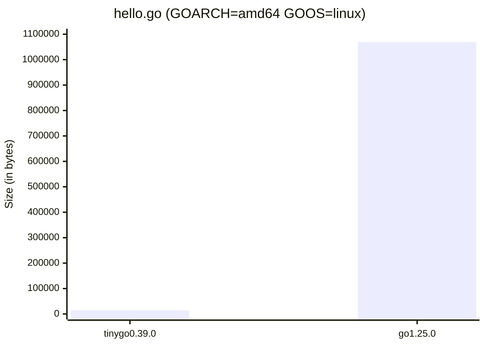
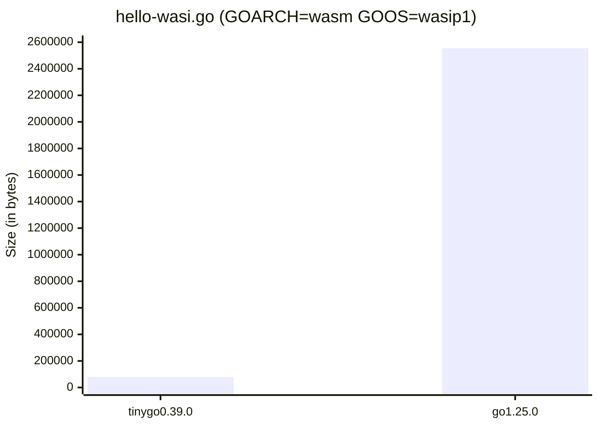

# Sizes

https://mermaid.js.org/syntax/xyChart.html

```mermaid
xychart-beta
    title "hello.go (GOARCH=amd64 GOOS=linux)"
    x-axis [tinygo0.39.0, go1.25.0]
    y-axis "Size (in bytes)" 0 --> 1100000
    bar [14488, 1069240]
```

```mermaid
xychart-beta
    title "hello-wasi.go (GOARCH=wasm GOOS=wasip1)"
    x-axis [tinygo0.39.0, go1.25.0]
    y-axis "Size (in bytes)" 0 --> 2600000
    bar [80127, 2555354]
```
